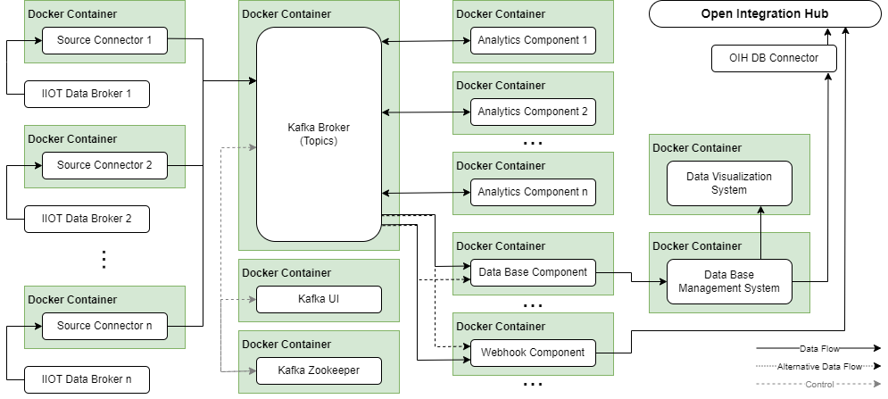

[Go back](../README.md)

<center><h1>OIH Edge Extension L-Variant</h1></center>

## Introduction

The **OIH Edge Extension L-Variant** is a software solution for deploying, connecting and managing different IIoT data 
producers, consumers and processing streams. It is based on Apache Kafka and uses a mesh of Edge Flow components that 
write their data into Kafka topics and can dynamically be connected to each other in order to realize complex data 
pipelines and multi-connectivity.  

## Content

- [Overview](#overview)
- [Components](#components)
- [Deployment](#deployment)
- [Data format](#data-format)
- [Test setup](#test-setup)
- [Contribution](#contribution)

<hr>

## Overview

The diagram seen below shows the architecture of the OIH Edge Extension L-Variant and gives an overview of the 
available components.



### Kafka broker

The Kafka broker is the main component that all producers, consumers and streams connect to in order to write their data
into a topic or subscribe to topics to consume data. If a component wants to write data into a topic that doesn't exist 
it is created automatically. 

### Kafka Zookeeper

The Kafka broker connects to the Zookeeper which holds records of the broker's metadata and is essential for 
coordinating more than one broker within a Kafka cluster.

### Kafka UI

Kafka-UI is an open source Kafka management tool and can be accessed by a web browser via the address:
> http://localhost:8081

Kafka-UI provides a web interface for inspecting the current state of the connected Kafka cluster or managing topics and 
messages.

## Deployment

### Initial deployment

The initial deployment sets up a Kafka cluster containing the Kafka Zookeeper, a Kafka broker and the Kafka-UI management 
tool.

> 1. Clone the repository
> 2. Create your own Edge Flow configuration or use an existing demo configuration and copy it to the main_config folder
> 3. To build and run the Docker containers navigate to the project root folder in a console window and execute the 
> following commands:
> - **docker-compose build**
> - **docker-compose run app**

The Kafka-UI can be accessed by a web browser via the following address:
> **Kafka-UI**: http://localhost:8081 

### Extended initial deployment

If you don't have access to an Influx database, Chronograf or Grafana you can use the extended initial deployment method
that deploys these components in addition to the Kafka cluster and Kafka-UI.

The Docker containers with the Grafana and Chronograf data management and visualization tools can be accessed by a web
browser via the following addresses:
> **Grafana**: http://localhost:3000 <br>
> **Chronograf**: http://localhost:8888

To stop the containers use:
> - **docker-compose stop**
>
> or
> - **docker-compose down** (deletes the containers after stopping)

After the initial deployment is complete other components can be started individually at any time. The deployment and 
configuration of the available components is explained in the [Components](#components) section.

Alternatively there are two demo cases that can be used to deploy a package of preconfigured components. These demo 
cases are explained further in the [Test setup](#test-setup) section.

## Components

All L-Variant components are deployed as single Docker containers and can be divided in three different groups that are
similar to the S-Variant. Source components are realized as Kafka producers and write machine data into a predefined 
topic. Sink components are Kafka consumers and subscribe to topics in order to process new messages and write the data
into a database or send it to a webhook. Analytics components however subscribe to topics, process new messages and 
write the result into another topic. The following sub-chapters describe how to configure and deploy these components. 

### Source components (Producers)

- #### [IIoT-Simulator](./producers/iiot-simulator/README.md)
- #### [MQTT](./producers/mqtt/README.md)
- #### [OPCUA](./producers/opcua/README.md)

### Sink components (Consumers)

- #### [Influx](./consumers/influx/README.md)
- #### [Webhook](./consumers/webhook/README.md) 

### Analytics components (Streams)

- #### [Pay-per-x](./streams/payperx/README.md) 
- #### [Aggregator](./streams/aggregator/README.md)
- #### [Anonymizer](./streams/anonymizer/README.md)

## Data format

The OIH Edge Extension internal data scheme follows the OIH JSON data pattern in which there is a `metadata` and `data` 
tag. The `metadata` tag contains info like a machine ID or other identifiers for the data source. The `data` tag 
contains sensor IDs which are represented by tags that can store several data value sets in an array as shown below. As 
Kafka messages have a `key:value` structure all producers use a predefined `machineID` that is used as `key` and the 
original message as `value` when they write data into a topic.   

```
{
    'metadata': {
        'deviceID': "MainOffice"
    },
    'data': {
        "Sensor1": [
            {"timestamp":"2021-07-30T09:24:29","value":"26.48"},
            {"timestamp":"2021-07-30T09:25:29","value":"27.48"}
        ]
    }
}
```

## Test setup

The OIH Edge Extension L-Variant comes with two demo cases which can be found in the `/democases` folder and deploy a 
package of preconfigured components to demonstrate a complex data processing pipeline.

### Demo case 1

Demo case 1 sets up the following data flow:

```
        IIoT-Simulator-Producer 
                   🡓
                Topic A
                🡗     🡖
InfluxDB-Consumer      PayperX-Stream
                              🡓
                           Topic B
                              🡓
                      InfluxDB-Consumer
```

It is stored in a file called `docker-compose_demo_1.yml` and can be found inside the `/democases` folder.

```
---
version: "3.8"
services:    
    simulator:
        build: ./../producers/ematecsimulator/.
        volumes:
            - ./../producers/ematecsimulator/configs/config_democase_1.json:/app/configs/config.json
            - ./../producers/ematecsimulator/configs/logging_democase_1.yml/:/app/configs/logging.yml
    influx_consumer:
        build: ./../consumers/influx/.
        network_mode:
          host
        volumes:
          - ./../consumers/influx/logs/demo_case_1_logs/:/influx/logs/
          - ./../consumers/influx/config/config_demo_case_1.json:/influx/config/config.json
    payperx:
        build: ./../streams/payperx/.
        network_mode:
            host
        volumes:
            - ./../streams/payperx/config/config_democase_1.json:/app/config/config.json
    influx_consumer_2:
        build: ./../consumers/influx/.
        network_mode:
          host
        volumes:
          - ./../consumers/influx/logs/demo_case_1_logs_2/:/influx/logs/
          - ./../consumers/influx/config/config_demo_case_1_influxconsumer_2.json:/influx/config/config.json
```

To deploy it navigate to the `/democases` folder and execute to following command in a console window:

> - **docker-compose -f docker-compose_demo_1.yml up** 

### Demo case 2

Demo case 2 sets up the following data flow:

```
        IIoT-Simulator-Producer 
                   🡓
                Topic A
                🡗     🡖
InfluxDB-Consumer      Aggregator-Stream
                              🡓
                           Topic B
                           🡗     🡖
          InfluxDB-Consumer       Anonymizer-Stream
                                           🡓
                                        Topic C
                                           🡓
                                   Webhook-Consumer
```

It is stored in a file called `docker-compose_demo_2.yml` and can be found inside the `/democases` folder.

```
---
version: "3.8"
services:    
    simulator:
        build: ./../producers/ematecsimulator/.
        volumes:
            - ./../producers/ematecsimulator/configs/config_democase_2.json:/app/configs/config.json
            - ./../producers/ematecsimulator/configs/logging_democase_2.yml/:/app/configs/logging.yml
    influx_consumer:
        build: ./../consumers/influx/.
        network_mode:
          host
        volumes:
          - ./../consumers/influx/logs/demo_case_2_logs/:/influx/logs/
          - ./../consumers/influx/config/config_demo_case_2.json:/influx/config/config.json
    aggregator:
        build: ./../streams/aggregator/.
        volumes:
            - ./configs/config_demo_case_2.json:/app/configs/config.json
            - ./configs/logging_demo_case_2.yml/:/app/configs/logging.yml
    influx_consumer_2:
        build: ./../consumers/influx/.
        network_mode:
          host
        volumes:
          - ./../consumers/influx/logs/demo_case_1_logs_2/:/influx/logs/
          - ./../consumers/influx/config/config_demo_case_1_influxconsumer_2.json:/influx/config/config.json
    anonymizer:
        build: ./../streams/anoymizer/.
        volumes:
            - ./configs/config_demo_case_2.json:/app/configs/config.json
            - ./configs/logging_demo_case_2.yml/:/app/configs/logging.yml
    webhook_consumer:
        build: ./../consumers/influx/.
        volumes:
          - ./../consumers/webhook/logs/demo_case_2_logs/:/webhook/logs/
          - ./../consumers/webhook/config/config_demo_case_2.json:/webhook/config/config.json

```

To deploy it navigate to the `/democases` folder and execute to following command in a console window:

> - **docker-compose -f docker-compose_demo_1.yml up**

To stop the demo cases execute one of the following commands:

> - **docker-compose -f docker-compose_demo_1.yml stop**
>
> or
> - **docker-compose -f docker-compose_demo_1.yml down** (deletes the containers after stopping)

## Contribution

If you want to write a documentation for your component use this [template](./docs/doc_template.md) as basic structure.
