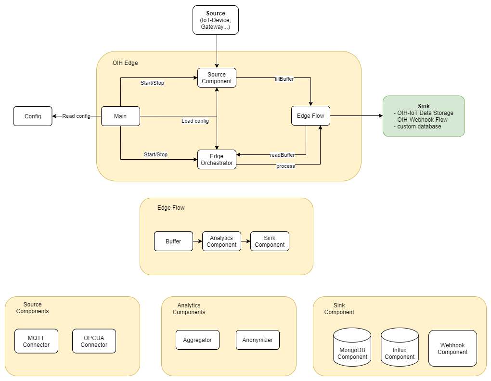
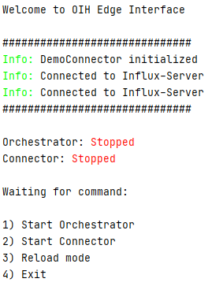
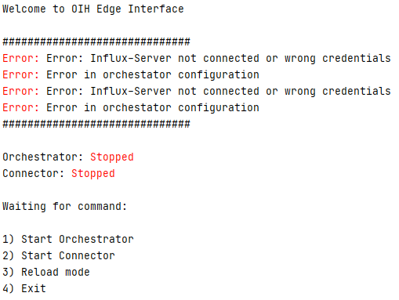
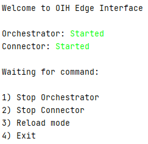
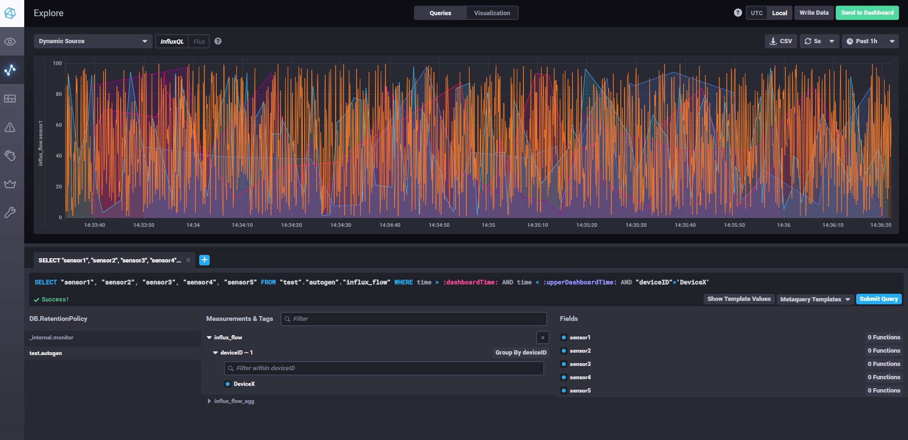
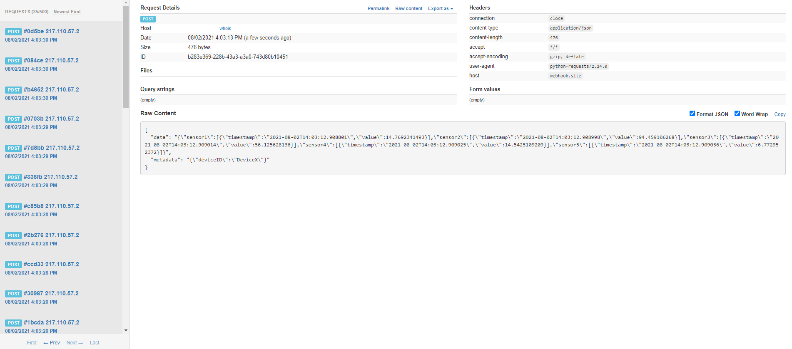
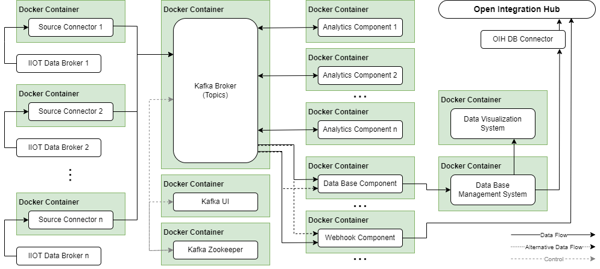

# <center>OIH Edge Extension</center>

# Introduction

OIH Edge Extension is an open source framework for IIoT edge device connectivity and data processing as part of the Open 
Integration Hub project. Its main purpose is helping users to integrate their devices in third party systems via the 
OIH platform. The OIH Edge Extension is available in two variants which are called S- and L-Variant.<br>

> The **S-Variant** is a lightweight Python application and can execute a single Edge Flow to realize a predefined data 
> pipeline. It can be deployed as a single Docker container or, depending on the test case, as a package that contains
> additional components such as InfluxDB, Chronograf and Grafana.
> 
> The **L-Variant** is based on Apache Kafka and uses a mesh of Edge Flow components that write their data into Kafka 
> topics and can dynamically be connected to each other in order to realize complex data pipelines and 
> multi-connectivity.    

# Content

[<h3>OIH Edge Extension S-Variant</h3>](#oih-edge-extension-s-variant)
- [Overview](#overview)
- [Deployment](#deployment)
- [Edge Flow configuration](#edge-flow-configuration)
- [Component configuration](#component-configuration)
- [Data format](#data-format)
- [Test setup](#test-setup)

[<h3>OIH Edge Extension L-Variant</h3>](#oih-edge-extension-l-variant)
- [Overview](#overview)
- [Deployment](#deployment)

<br><hr>

# OIH Edge Extension S-Variant

## S-Variant overview
The diagram seen below shows the architecture of the OIH Edge Extension S-Variant and gives an overview of the 
available components.



### Main
The Main class ist the entrypoint of the application and performs the following task:

- loading of the main menu and processing of user input ('load_menu()' and 'get_input()').
- monitoring and display of errors or status changes of all application components ('error_checker()').
- loading of the configuration file ('load_config()').
- creation of the buffer, the source component and the orchestrator ('load_config()').

### EdgeOrchestrator
The EdgeOrchestrator class is responsible for the assembly, data forwarding and controlling of the Edge Flow. Its main 
functions are:

- assembly of an Edge Flow by using the supplied configuration ('analyse_config()').
- data forwarding between the Edge Flow's components ('run_flow()').
- examination of all Edge Flow components for errors or status changes ('error_and_info_checker()').

### Buffer
The Buffer class provides a cache for the Source Component to avoid it being slowed down by delays within the Edge Flow. 
Its main function is:

- caching of the Source Component's data ('fill_buffer()'). The function is called by the Source Component and expects 
data in dict form.
 
### ComponentBaseClass (abstract class)
All components that can be part of an Edge Flow have to inherit from the ComponentBaseClass and override its `process()` 
and `__init__()` methods. This ensures that the Edge Orchestrator can forward their processed data and examine them for 
errors or status changes. The `process()` method expects data in dict format as input and returns a dict with the same 
or altered data after it has been processed. The Edge Orchestrator calls this method in order to forward data between 
the Edge Flow components.

### ConnectorBaseClass (abstract class)
All Source Components have to inherit from the ConnectorBaseClass and override its `__init__()` and `run()` methods. 
The ConnectorBaseClass itself inherits from the threading class in order to guarantee a non-blocking query of data. The 
`run()` method moves within two nested loops depending on whether the Source Component is started, stopped or terminated.

## Deployment
There are two different deployment configurations depending on the test cases you want to use. 

### Basic deployment (creates a Docker container with the Python application):  

> 1. Clone the repository
> 2. Create your own Edge Flow configuration or use an existing demo configuration and copy it to the main_config folder
> 3. Build and run the Docker container with the following commands:
>   - **docker-compose build**
>   - **docker-compose run app**
 
### Extended deployment (Basic deployment + InfluxDB, Grafana and Chronograf as used in [Test case 1](#test-case-1-configjson))     

> 1. Clone the repository
> 2. Create your own Edge Flow configuration or use an existing demo configuration and copy it to the main_config folder
> 3. Build and run the Docker containers with the following commands:
>   - **docker-compose -f docker-compose-test.yml build**
>   - **docker-compose -f docker-compose-test.yml run app**

The Docker containers with the Grafana and Chronograf data management and visualization tools can be accessed by a web 
browser via the following addresses:
> **Grafana**: http://localhost:3000 <br>
> **Chronograf**: http://localhost:8888

To stop the containers use:
> - **docker-compose stop**
> 
> or
> - **docker-compose down** (deletes the containers after stopping) 

## Edge Flow configuration

Edge Flow configurations consist of a buffer configuration and a step configuration. The first component of the step 
configuration is always a connector component (MQTT, OPCUA, DB Connector,...). Any number of components can be connected 
downstream of the connector. Usually the last step is a database or webhook component to either persist the data or to 
transfer it to an OIH flow.

Example Edge Flow configuration:


        "name": "example flow",
        "description": "An example flow with 4 Steps.",
        "buffer": {
                "config": {
                    "type": "local",
                    "database": {},
                    "maxsize": 1000,
                    "maxpolicy": "override"
                                }
                },
        "steps": [
                    {
                    "name": "connector",
                    "config": {}
                    },
                    {
                    "name": "component1",
                    "config": {}
                    },
                    {
                    "name":"component2",
                    "config":{}
                    },
                    {
                    "name": "component3",
                    "config": {}
                    }
        ]


## Component configuration

In OIH Edge there are 3 types of components: source, analytics and sink components. 

### Source components

Source components are always the first step of the OIH Edge Flow. The task of these components is to establish 
connectivity (to an IoT device) and to carry out user-defined data mapping. The source components write their data into
the buffer where they can then be processed by the EdgeOrchestrator.

#### MQTT Connector

     "name": "connector",
     "config": {
                "host": "",
                "port": "",
                "clientid":"",
                "security": {
                              "cert_file": "",
                              "username": "",
                              "password": ""
                            },
       "topic": "",
       "mapping": [{
             "topicName": "",
             "converter": {
                    "type": "linemetrics"
                    }}
       ]
     }

#### OPCUA Connector

    {
        "name": "connector",
        "config": {
            "url": "",
            "username": "",
            "password": "",
            "deviceid": "",
            "nodeids": ["ns=3;i=1012", "ns=3;i=1018", "ns=3;i=1013"],
            "pol_time": 0.5}
    }

### Analytics components

Analytics components use different methods to process or alter data in order to aggregate or anonymize them. The 
processed data is then returned to the EdgeOrchestrator.  

#### Aggregator

The OIH Edge Aggregator component is compatible with the _pandas package_ and accepts every pandas aggregate function as 
method input.

    Example User configuration of the Aggregator component.
        'config':{ 
                'default': {"method":'mean',
                            "window_size":'5s'},	                            
                'sensor2': {"method":'last',
                            "window_size":'10s'} 
                            }
                    '...':{...}

#### Anonymizer

The OIH Edge Anonymizer component uses different methods to anonymize data.

    Example User configuration of the Anonymizer component.
    'config'={ 
        'default': {
            'name':'thresholder',
                'window': 10,
                'threshold':(100,200),
                'substitution': (120,180)  #also calcuation or deletion of th sub values is possible. e.g. ('delete','mean')
            },
        'Sensor2':{
            'name':'skipN',
                'N': 10,
            },
        'Sensor4':{
            'name':'randomizer',
                'window': 10,
                #'percent': 0.5, 
                'distribution': {'name': 'win_dist',
                                'std': 1
                                },
                                {'name': 'random',
                                'range': (1,100)
                                }
            },
        'Sensor5':{
            'name':'hider',
            },
        'Sensor6':{
            'name':'categorizer',
            'cats':[-float("inf"),10,20,30,40,float("inf")],   #categories <10, 10-20, 20-30, 30-40, >40   #-float("inf") 
            'labels':[1,2,3,4,5]    #len(labels) must be len(cats)-1 
            oder
            'cats':(-30,130,50)
            'labels':False
            },
        }

### Sink components

Sink components take data packages, store them in databases or, in the case of the webhook component, send them to an 
http endpoint.

#### Webhook Connector

The webhook connector takes a data package and sends it to a predefined http address via POST request.

    User configuration of Webhook component.
    {
                "name": "webhookconnector",
                "config": {
                    "url": "http://webhooks.localoih.com/hook/flowID"
                }
            }

#### MongoDB Connector

The MongoDB connector stores data packages inside a MongoDB database in JSON format.

    {
        "name": "mongodbconnector",
        "config": {
            "ip": "",
            "port": "",
            "db": "test_db",
            "collection": "test_agg_data",
            "username": "",
            "password": ""
        }
    }

#### InfluxDB Connector

The InfluxDB connector stores data packages inside an Influx database that is optimized for time series data.

    User configuration of the Influx component.
    {
    "name": "influxdbconnector",
    "config": {
            "host": "",
            "port": "",
            "db": "edge_adapter_test_db",
            "measurement": "linemetrics_mqtt_data",
            "username": "",
            "password": ""
            }}

## Data format

The OIH Edge internal data scheme follows the OIH JSON data pattern in which there is a `metadata` and `data` tag. The 
`metadata` tag contains info like a machine ID or other identifiers for the data source. The `data` tag contains sensor 
IDs which are represented by tags that can store several data value sets in an array as shown below.

```
{
    'metadata': {
        'deviceID': "MainOffice"
    },
    'data': {
        "Sensor1": [
            {"timestamp":"2021-07-30T09:24:29","value":"26.48"},
            {"timestamp":"2021-07-30T09:25:29","value":"27.48"}
        ]
    }
}
```

## Test setup

After cloning the repository there are two different test configurations present in the `mainconfig` folder. OIH Edge 
will automatically use the configuration file with the name `config.json`.  

### Test case 1 `config.json` ###

The standard configuration uses a 4-step Edge Flow with the following components:
1. Demo connector component
2. InfluxDB component
3. Aggregator component
4. InfluxDB component

```
{
    "name": "demo-flow",
    "description": "",
    "buffer": {
        "config": {
            "type": "local",
            "database": {
                },
            "maxsize": 1000,
            "maxpolicy": "override"
        }
    },
    "steps": [
		{
            "name": "connector",
            "config": {
                "sensors": ["sensor1", "sensor2","sensor3","sensor4","sensor5"],
                "randomrange": [1,100],
                "period":0.1
            }
        },
        {
            "name": "influxdbconnector",
            "config": {
                "host": "",
                "port": "8086",
                "db": "test",
                "measurement": "influx_flow",
                "username": "",
                "password": ""
            }
        },
        {
            "name":"agg",
            "config":{
            "default": {
                "method":"mean",
                "window_size":"5s"},
            "sensor2": {
                "method":"last",
                "window_size":"10s"},
            "sensor3": {
                "method":"None",
                "window_size":"None"}
            }
        },
        {
            "name": "influxdbconnector",
            "config": {
                "host": "",
                "port": "8086",
                "db": "test",
                "measurement": "influx_flow_agg",
                "username": "",
                "password": ""
            }
        }
    ]
}
```

The hereby created Edge Flow produces random sensor values, saves the raw data to an InfluxDB, aggregates the data with 
different aggregation methods in the next step and saves it to the InfluxDB again. In order to use the first test setup 
the connection properties and credentials of an existing Influx database have to be inserted into the configuration 
file. If no Influx database is installed yet, it can be downloaded from [influxdata](https://www.influxdata.com/get-influxdb/) 
or deployed automatically by running `docker-compose-test` as described under [deployment](#deployment).

After starting the application as described under [deployment](#deployment) the console output should look something 
like this:



The status field indicates that the demo connector has been initialized and both instances of the InfluxDB connector are 
connected to the databases. If the entered properties or credentials are faulty the status field indicates these errors 
and produces an output as seen below:

 

After the connector and the orchestrator both have been started the data transfer begins and can be visualized in 
Grafana or Chronograf respectively.



### Test case 2 `config2.json` ###

The second configuration file uses a 2-step Edge Flow with the following components:
1. Demo connector component
2. Webhook component

```
{
    "name": "demo-flow",
    "description": "",
    "buffer": {
        "config": {
            "type": "local",
            "database": {
            },
            "maxsize": 1000,
            "maxpolicy": "override"
        }
    },
    "steps": [
		{
            "name": "connector",
            "config": {
                "sensors": ["sensor1", "sensor2","sensor3","sensor4","sensor5"],
                "randomrange": [1,100],
                "period":0.1
            }
        },
        {
            "name": "webhookconnector",
            "config": {
            "url": ""
            }
        }
    ]
}
```

The hereby created Edge Flow produces random sensor values and sends them to a predefined webhook. If there is no local 
webhook available the url of a test webhook address which can be generated for free on several webhook test pages 
(i.e. https://webhook.site) can also be used. After starting the data transfer the webhook page should show the incoming 
data packets like seen below:



<br><hr>

# OIH Edge Extension L-Variant

## Overview

The diagram seen below shows the architecture of the OIH Edge Extension L-Variant and gives an overview of the 
available components.



### Kafka broker

The Kafka broker is the main component that all producers, consumers and streams connect to in order to write their data
into a topic or subscribe to topics to consume data. If a component wants to write data into a topic that doesn't exist 
it is created automatically. 

### Kafka Zookeeper

The Kafka broker connects to the Zookeeper which holds records of the broker's metadata and is essential for 
coordinating more than one broker within a Kafka cluster.

### Kafka UI

Kafka-UI is an open source Kafka management tool and can be accessed by a web browser via the address:
> http://localhost:8081

Kafka-UI provides a web interface for inspecting the current state of the connected Kafka cluster or managing topics and 
messages.

## Components

All L-Variant components are deployed as single Docker containers and can be divided in three different groups that are
similar to the S-Variant. Source components are realized as Kafka producers and write machine data into a predefined 
topic. Sink components are Kafka consumers and subscribe to topics in order to process new messages and write the data
into a database or send it to a webhook. Analytics components however subscribe to topics, process new messages and 
write the result into another topic. The following sub-chapters describe how to configure and deploy these components. 

### Source components (Producers)

#### MQTT
#### OPCUA

### Sink components (Consumers)

### Analytics components (Streams)

## Deployment


## Data format

## Test setup